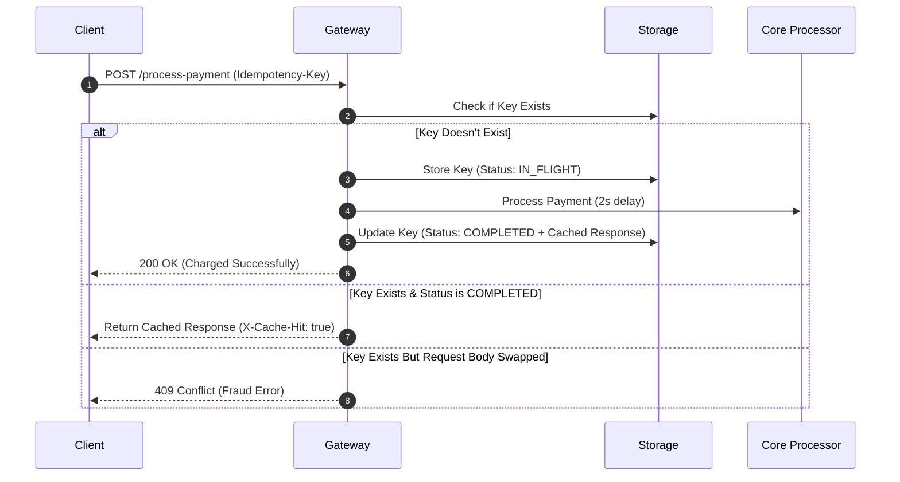

# Idempotency Gateway Challenge

Hey there! This is my implementation of a payment middleware gateway built with Spring Boot. The goal of this project is pretty straightforward: make sure that if a client retries a payment request due to a network glitch or timeout, they don't end up double-charging the user.

## How it works (The Logic Flow)

## How to run it locally
If you want to run it locally use: .\mvnw.cmd spring-boot:run on windows, and ./mvnw spring-boot:run on Mac or Linux

## Testing the API

To test out the endpoint, you can send a POST request here:

Endpoint: POST /process-payment

Header Required: Idempotency-Key: <any-unique-string>

Body Format (JSON):
{
    "amount": 100,
    "currency": "RWF"
  }

## Developer's Choice: Keeping RAM safe from exploding
For the engineering challenge, I decided to tackle a major real-world bottleneck: memory consumption.

Right now, the assignment lets us store keys in a native Java ConcurrentHashMap. That works perfectly for a quick demo, but in a real fintech company handling millions of transactions, keeping keys in RAM forever will eventually cause the server to run out of memory and crash.

To fix this, I built an asynchronous background cleaner thread using a ScheduledExecutorService. It runs automatically every minute and sweeps through our map. If it finds a completed transaction that is older than 5 minutes, it prunes it out of memory. This keeps our app's RAM footprint small, clean, and safe for long-term use without disrupting any active, in-flight payments.
